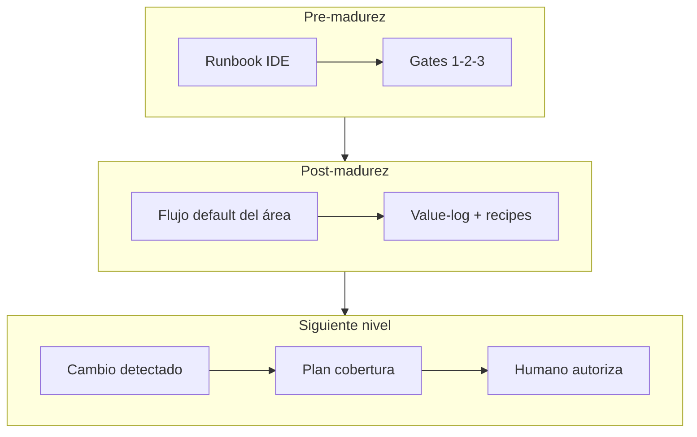

# Adopción — cómo lo usan quienes no lo desarrollaron

**Vista interactiva (Canvas):** si generaste `adoption-personas.canvas.tsx` en Cursor, ábrelo al lado del chat (Canvas local del proyecto; no se versiona).

Idea central: quien no construyó F0–F8 no necesita el historial de fases; necesita un camino corto (runbook + agents + gates) y, más adelante, propuestas que **él autorice**.

## Vista rápida

| Etapa | Qué usa | Éxito que nota |
|-------|---------|----------------|
| Pre-madurez | Runbook · agents · MCP/tools · gates | Menos fricción vs few-shot; evidencia |
| Post-madurez | Mismo flujo como default · value-log | Tiempo predecible; admin no en cada Gate |
| Siguiente nivel | Alerta coverage + autorización | Cobertura proactiva sin auto-apply |

---

## QA (no construyó el lab)

| | Pre | Maduro | Next |
|--|-----|--------|------|
| **Día** | Sigue [COPILOT-RUNBOOK](COPILOT-RUNBOOK.md); Analyst→Planner; MCP/tools; Gates; no merge | Automatiza por agentes de forma habitual; revisa analysis/plan; anota value-log | Recibe propuesta de coverage gap; autoriza o rechaza el plan |
| **Siente** | Más pasos que few-shot; más evidencia | Método = default; menos paste | El sistema prioriza; él decide |
| **Necesita** | Runbook corto · 1 demo · ayuda en primer Gate | Catálogo · recipes · Reviewer | Propuestas claras · sin ruido |

## Admin / lead

| | Pre | Maduro | Next |
|--|-----|--------|------|
| **Día** | Onboard QAs; prompts/agents; smokes; value-log; agentes least-privilege | Ajusta knowledge; aprueba recipes; métricas ligeras | Coverage detector + swap LLM si hace falta; vigila gates |
| **Siente** | Dueño; riesgo de cuello de botella | Mantenimiento predecible | Escala detección, no autonomía ciega |
| **Necesita** | Índice claro · no clonar monorepo | Changelog agents · evals al cambiar contratos | LLM-PORTABILITY · allowlist · ADR |

## Late joiner (nuevo al área)

| | Pre | Maduro | Next |
|--|-----|--------|------|
| **Día** | 3 docs + demo + shadow | Runbook + 1 pair; ejemplos en value-log | También autoriza planes de coverage |
| **Siente** | Abrumado si lee 15 evals; OK con onboarding corto | Lab = producto interno | Parte del loop de calidad continua |
| **Necesita** | Onboarding 1 página | Owners · canal dudas | Misma disciplina de gates |

---

## Onboarding mínimo (5 piezas)

1. [COPILOT-RUNBOOK.md](COPILOT-RUNBOOK.md)
2. [VALUE-AND-KPIS.md](VALUE-AND-KPIS.md)
3. `bash scripts/demo_gate2_recipe_flow.sh`
4. [evals/manual-value-log.md](evals/manual-value-log.md)
5. [LLM-PORTABILITY.md](LLM-PORTABILITY.md) — solo si preguntan por otro runtime

**Anti-patrón:** exigir leer evals 001–015 o `OPENAI_API_KEY` para empezar.

Ver [ROADMAP.md](ROADMAP.md) · [NEXT-STEPS.md](NEXT-STEPS.md)
