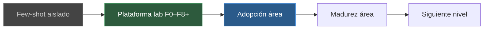

# Roadmap gráfico — dónde estamos y a dónde vamos

**Vista interactiva (Canvas):** si generaste `ai-evolution-roadmap.canvas.tsx` en Cursor, ábrelo al lado del chat (Canvas local del proyecto; no se versiona).

**Estamos aquí:** plataforma F0–F8+ lista · cuello de botella = **adopción de área** (no más infra).

| Etapa | Estado | Nota | Recomendación |
|-------|--------|------|---------------|
| Few-shot | Pasado | Baseline | No volver como default |
| Plataforma | Hecho | Contracts, tools, MCP, recipes, transfer | Mantener allowlist; no LangGraph aún |
| **Adopción área** | **Ahora** | Runbook + value-log | 1 QA dogfood + filas manuales |
| Madurez área | Próximo | Varios QAs, tiempos comparables | KPI = uso, no dashboard $ |
| Siguiente nivel | Luego | Coverage detector → plan → Gate humano | Mismos contratos; sin auto-merge |

## Recomendaciones (orden)

1. Dogfood IDE + [manual-value-log](evals/manual-value-log.md)
2. 2–3 historias vs few-shot (contexto sense)
3. CI = smokes opcionales (no sustituye gates)
4. Coverage-change detector (después) + [LLM-PORTABILITY](LLM-PORTABILITY.md)

## Fronteras que no se mueven

- LLM propone · tools ejecutan · Gates 1/2/3 humanos · no merge/push por agentes

Ver también: [VALUE-AND-KPIS](VALUE-AND-KPIS.md) · [NEXT-STEPS](NEXT-STEPS.md) · [personas de uso](ADOPTION-PERSONAS.md)
